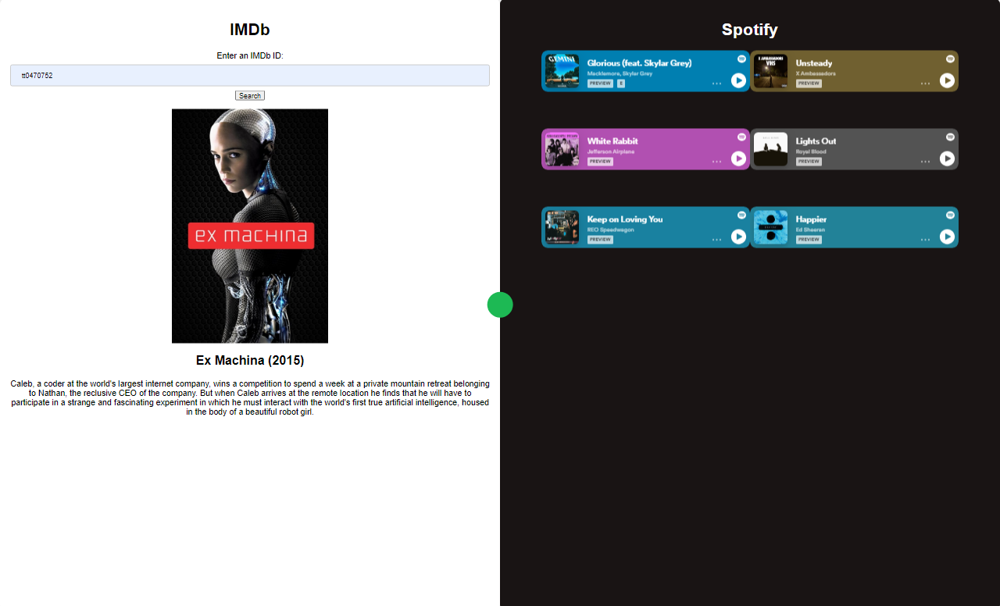
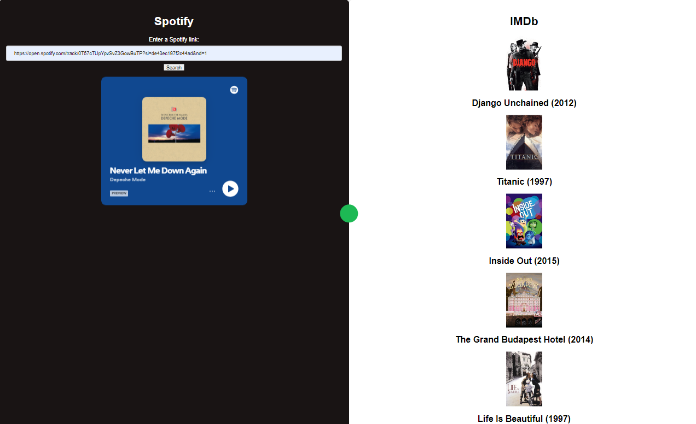

# VibeSync
___
A web application that recommends films based on Spotify links and songs based on IMDb links so that their overall vibes match. It uses the TMDb and Spotify APIs along with the Vader-sentiment.js library to perform sentiment analysis on movie descriptions.
The app is built with Node.js and Express.js.
It was my high-school certificate in informatics project.

